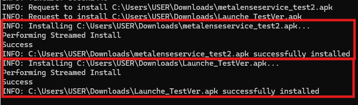

# Launcher V2
Launcher V2는 METALENSE 2 에서 실행되는 전용 런처 애플리케이션으로,
사용자가 설치된 앱을 손쉽게 실행하거나 앱을 관리할 수 있도록 돕습니다.

이 저장소에서는 프로그램 설치 파일, 매뉴얼, 그리고 업데이트 기록을 제공합니다.


## 폴더 구조 및 파일 설명
```
├──docs 
│  ├──문서 관련 데이터
├──LauncherV2
│  ├──Launcher_[current version].apk
│  ├──app-arm64-v8a-debug.apk
│  ├──METALENSE2_Launcher_[current version]_매뉴얼.pdf
├──LICENSE.md
├──README.md
```

1. Launcher_[current version].apk
 	  - 런처 V2 설치 APk 파일입니다.

2. app-arm64-v8a-debug.apk
 	  - 런처의 기능을 보조하는 필수 서비스앱 설치 APk 파일입니다.

3. METALENSE2_Launcher_[current version]_매뉴얼.pdf
 	  - 런처 V2 사용자 매뉴얼입니다.


## 설치 방법
1. METALENSE 2 기기를 PC와 유선 연결합니다.
2. METALENSE 2를 켭니다.
3. PC에서 Scrcpy.exe를 실행합니다.
4. Scrcpy에 1번 파일 드래그&드롭합니다.
5. Scrcpy에 2번 파일 드래그&드롭합니다.
6. 설치가 모두 완료되었는지 확인합니다.

7. Scrcpy 화면 상단을 아래로 드래그 -> 설정(톱니바퀴 버튼) -> 앱 -> 기본 앱 -> 홈 앱 -> Launcher_V2 선택합니다.
8. 홈 화면이 자동으로 변경됩니다.
9. 기기를 재시작합니다.

※ 런처 V2 설치 시, app-arm64-v8a-debug.apk 를 함께 설치해야 정상 작동합니다.
※ 해당 버전을 설치해야 METALENSE OPT와 연동할 수 있습니다.


## 매뉴얼
'METALENSE2_Launcher_[current version]_매뉴얼.pdf' 파일을 참고하세요.
애플리케이션의 주요 기능과 사용 방법이 상세히 설명되어 있습니다.
    

## 주요 기능

1. 앱 실행/종료
2. 앱 즐겨찾기 등록/삭제
3. Wifi 연결 기능
4. 사용자 맞춤 설정
5. 언어 설정(한국어/영어)
6. METALENSE OPT 연동


## 업데이트 / 릴리즈 노트

### 2.0.1
2025년 10월 28일
첫 공개 버전 배포
- 기본 기능 구현 완료

## License
© 2025 P&CSolution. All Rights Reserved.

본 소프트웨어(Launcher V2 및 서비스앱)와  
모든 관련 자료(매뉴얼, 설치 파일, 리소스 등)는 저작권법에 의해 보호됩니다.  
작성자의 명시적 서면 허가 없이 복제, 수정, 배포, 역공학, 리버스 엔지니어링을 금합니다.

본 소프트웨어는 "있는 그대로(as is)" 제공되며,  
사용 또는 재배포 과정에서 발생하는 모든 문제에 대해 작성자는 법적 책임을 지지 않습니다.