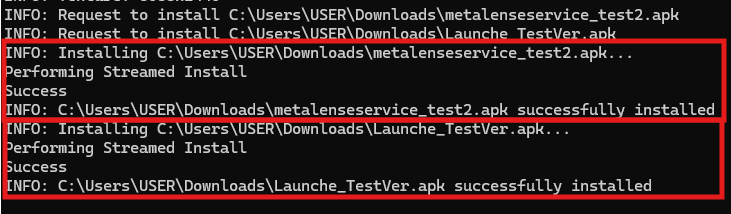

# Launcher V2
Launcher V2는 METALENSE 2 에서 실행되는 전용 런처 애플리케이션으로,
사용자가 설치된 앱을 손쉽게 실행하거나 앱을 관리할 수 있도록 돕습니다.

이 저장소에서는 프로그램 설치 파일, 매뉴얼, 그리고 업데이트 기록을 제공합니다.


## 폴더 구조 및 파일 설명
### 폴더 구조
```
├──docs 
│  ├──문서 관련 데이터
├──LICENSE.md
├──README.md
```

### Release에 포함된 파일
1. Launcher_[current version].apk
 	  - 런처 V2 설치 APK 파일입니다.

2. PNCService_[current version].apk
 	  - 런처의 기능을 보조하는 필수 서비스앱 설치 APK 파일입니다.

3. METALENSE2_Launcher_[current version]_Manual_KR.pdf
 	  - 런처 V2 사용자 매뉴얼(한글버전)입니다.
	  - 매뉴얼에 변경이 없을 경우, 이전 버전으로 업로드됩니다.

4. METALENSE2_Launcher_[current version]_Manual_ENG.pdf
 	  - 런처 V2 사용자 매뉴얼(영문버전)입니다.
	  - 매뉴얼에 변경이 없을 경우, 이전 버전으로 업로드됩니다.


## 설치 방법
1. METALENSE 2 기기를 PC와 유선 연결합니다.
2. METALENSE 2를 켭니다.
3. PC에서 Scrcpy.exe를 실행합니다.
4. Scrcpy에 1번 파일 드래그&드롭합니다.
5. Scrcpy에 2번 파일 드래그&드롭합니다.
6. 설치가 모두 완료되었는지 확인합니다.

7. Scrcpy 화면 상단을 아래로 드래그 -> 설정(톱니바퀴 버튼) -> 앱 -> 기본 앱 -> 홈 앱 -> Launcher_V2 선택합니다.
8. 홈 화면이 자동으로 변경됩니다.
9. 기기를 재시작합니다.

※ 런처 V2 설치 시, app-arm64-v8a-debug.apk 를 함께 설치해야 정상 작동합니다.
※ 해당 버전을 설치해야 METALENSE OPT와 연동할 수 있습니다.


## 매뉴얼
'METALENSE2_Launcher_[current version]_Manual.pdf' 파일을 참고하세요.
애플리케이션의 주요 기능과 사용 방법이 상세히 설명되어 있습니다.
    

## 주요 기능

1. 앱 실행/종료
2. 앱 즐겨찾기 등록/삭제
3. Wifi 연결 기능
4. 사용자 맞춤 설정
5. 언어 설정(한국어/영어)
6. METALENSE OPT 연동
7. XDM 연동 (개인정보 수집 동의 시)


## 업데이트 / 릴리즈 노트
### 2.1.0 (펌웨어 2.1.2 버전 이상 설치 필수)
2026년 2월 3일
FEATURE
- Camera 앱 추가
- 개인정보 수집 동의서 추가
- 하단 메뉴 버튼을 통해 메뉴창을 On/Off하는 기능 추가

CHANGE
- Media Player 앱 리뉴얼
- PDF Viewer 앱 리뉴얼
- 키보드에 현재 설정된 언어가 반영되도록 변경
- 일부 UI 문구 수정
- 음성 명령어 추가
- 장치 정보 UI 수정

FIXED
- Sleep 반복 시 런처가 강제 종료되는 현상 수정

### 2.0.3
2025년 12월 3일
FIXED
- 음성 명령어 인식 이슈 수정

### 2.0.2 (펌웨어 2.1.1 버전 이상 설치 필수)
2025년 11월 14일
FEATURE
- 안드로이드 기본 앱 실행 기능 추가
- 앱 실행 전 권한 확인 기능 추가

CHANGE
- Hand Ray 옵션(Magnetic, Ray Angle) 읽기/쓰기 방식 변경
- 지원하지 않는 앱 숨김 처리

FIXED
- 트래킹 중지 시 재부팅 불가 오류 수정
- 특수문자 입력 중 백스페이스 오류 수정
- 탬플릿 선택 창의 빈 화면 버튼 UI 오류 수정
- 즐겨찾기 등록할 앱 선택창에서 다음/이전 버튼 클릭 오류 수정
- 앱 최적화 시 토스트 메시지 출력 오류 수정

### 2.0.1
2025년 10월 28일
첫 공개 버전 배포
- 기본 기능 구현 완료


## License
© 2025 P&CSolution. All Rights Reserved.

본 소프트웨어(Launcher V2 및 서비스앱)와  
모든 관련 자료(매뉴얼, 설치 파일, 리소스 등)는 저작권법에 의해 보호됩니다.  
작성자의 명시적 서면 허가 없이 복제, 수정, 배포, 역공학, 리버스 엔지니어링을 금합니다.

본 소프트웨어는 "있는 그대로(as is)" 제공되며,  
사용 또는 재배포 과정에서 발생하는 모든 문제에 대해 작성자는 법적 책임을 지지 않습니다.

**본 소프트웨어에 포함된 제3자 라이브러리 및 오픈소스 라이선스 정보는 동봉된 `LICENSE.md` 파일에서 확인할 수 있습니다.**